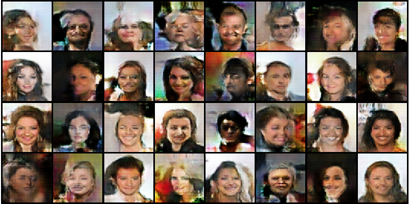

# WGAN-GP

#### Title
[Improved Training of Wasserstein GANs](https://arxiv.org/abs/1704.00028)

#### Abstract
Generative Adversarial Networks (GANs) are powerful generative models, but suffer from training instability. The recently proposed Wasserstein GAN (WGAN) makes progress toward stable training of GANs, but sometimes can still generate only low-quality samples or fail to converge. We find that these problems are often due to the use of weight clipping in WGAN to enforce a Lipschitz constraint on the critic, which can lead to undesired behavior. We propose an alternative to clipping weights: penalize the norm of gradient of the critic with respect to its input. Our proposed method performs better than standard WGAN and enables stable training of a wide variety of GAN architectures with almost no hyperparameter tuning, including 101-layer ResNets and language models over discrete data. We also achieve high quality generations on CIFAR-10 and LSUN bedrooms.

## Result

* The results are generated by trained network using **mnist** dataset during **20 epochs**.

## Train
    $ python main.py --mode train --scope [scope name]

* Set **[scope name]** uniquely.

## Test
    $ python main.py --mode test --scope [scope name]

* Set **[scope name]** to test using scoped network
* In **result** folder, generated images are saved under the **images** subfolder.
* In addition, **index.html** are created to illustrate the generated images.  

## Tensorboard
    $ tensorboard --logdir log/[scope] --port [(optinal) 4 digit port number]

Then, click **http://localhost:6006**

* You can change **[(optinal) 4 digit port number]**
* 4 digit port number = 6006 (default)
